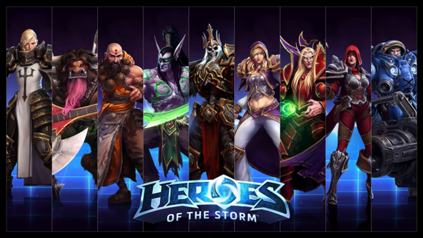
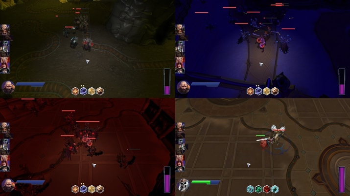
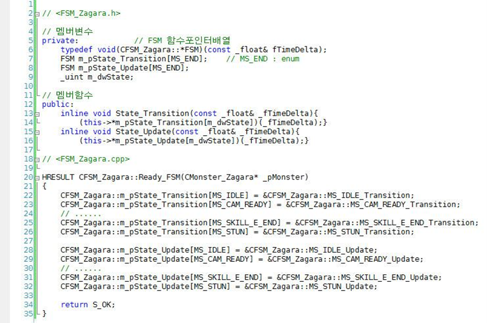
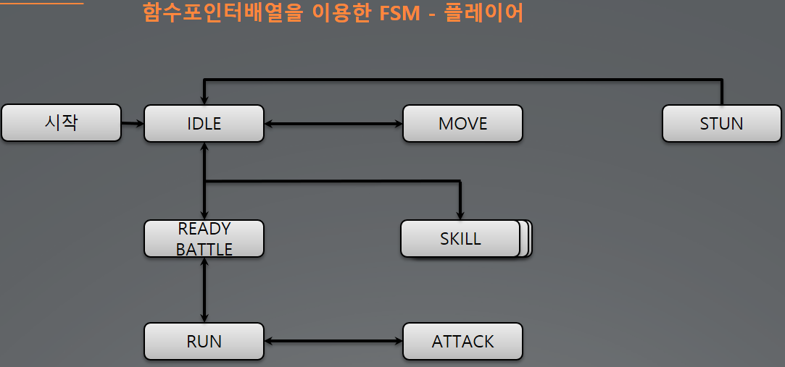
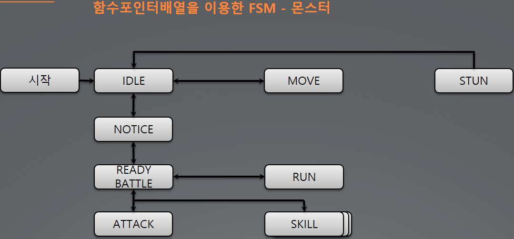
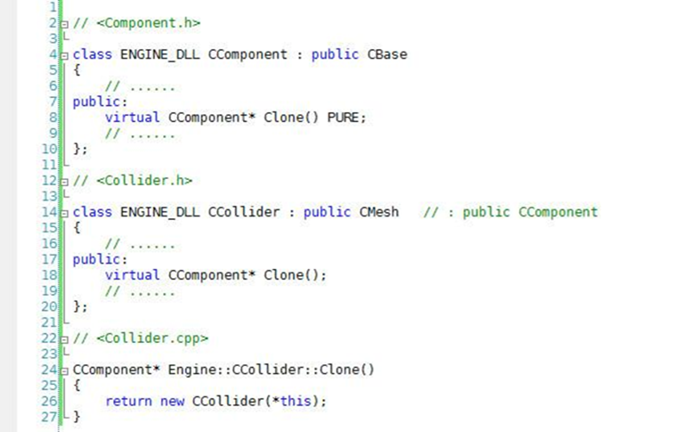
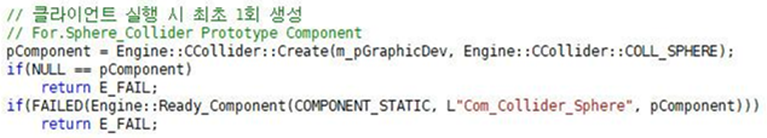
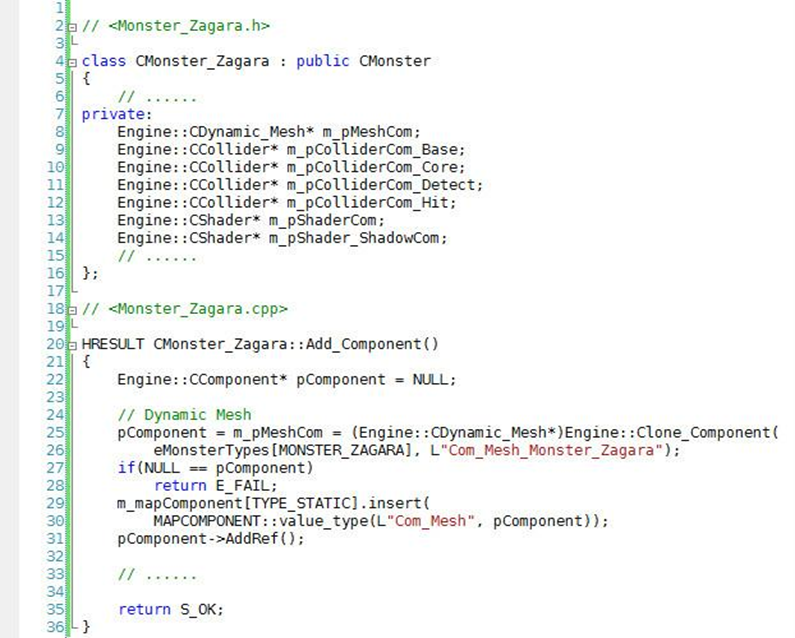
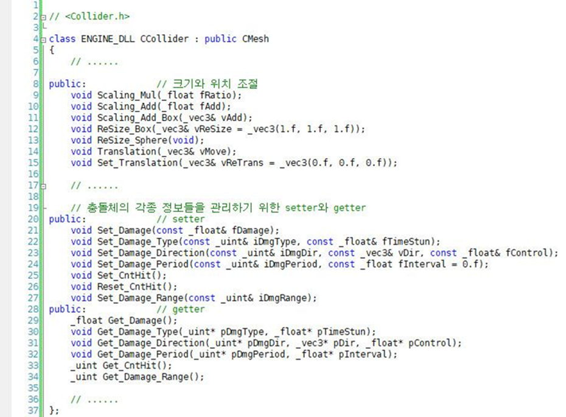
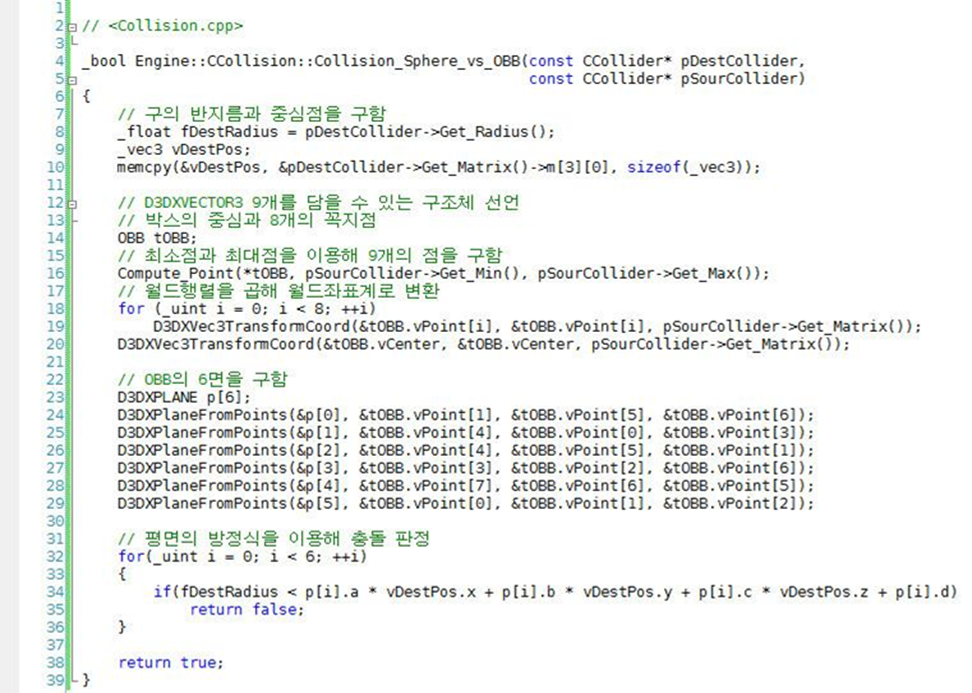

# 히오스 & 디아블로3 모작

## 시연 영상 및 게임 소개
<!---->
  

3D 쿼터뷰 액션 RPG  
9개의 교체 가능한 플레이어블 캐릭터  
5개의 스테이지 / 9개의 일반 몬스터 / 5개의 보스 몬스터

- 함수포인터배열을 이용한 FSM 구현 / 플레이어와 몬스터 AI 구현
- 프로토타입 패턴
- 컴포넌트 패턴
- 충돌

## 핵심 기술

### 함수포인터배열을 이용한 FSM 구현 / 플레이어와 몬스터 AI 구현

 
FSM 을 포함하는 클래스에서 전이함수와 동작함수만 호출할 수 있도록 설계  
FSM 의 상태를 외부에서 변경하지 못하도록 설계  
함수포인터배열을 이용해 한 번에 한 개의 상태만 가짐을 보장  
switch 와 if else 로 구현했던 FSM 에 비해 가독성이 뛰어나고 관리가 편했음  

 

### 프로토타입 패턴
 
 
 

프로토타입(원형)이 될 클래스에 Clone 함수를 순수 가상 함수로 선언  
원형이 될 클래스 내부에서 Clone 함수를 오버라이드  
객체가 생성될 때의 비용을 최소화  

### 컴포넌트 패턴
 

각각의 기능들이 구현되어 있는 컴포넌트들을 필요에 따라 멤버로 선언  
- Transform : 위치와 상태
- Resource(Buffer, Texture, Mesh) : 원시버퍼, 텍스쳐, 메쉬
- Collider - 충돌체
- Collision - 충돌체 간 충돌 계산
- Navigation - 네비게이션 메쉬
- etc.  

미리 생성해두었던 프로토타입을 복제하여 사용

### 충돌
 

<strong>충돌체 Collider</strong>  
충돌체의 크기와 위치를 설정하고 충돌에 대한 정보를 저장  
충돌 시 충돌 정보 전달

 

<strong>충돌 Collision</strong>  
구와 OBB 박스, 구와 구 간의 충돌 구현

## 담당 업무
| 이름 | 담당 |
|------|------|
| **문두르** | 프레임워크 / 플레이어와 몬스터 AI / 충돌 |
| **신*은** | MFC 툴 / 맵 |
| **엄*우** | 쉐이더 |
